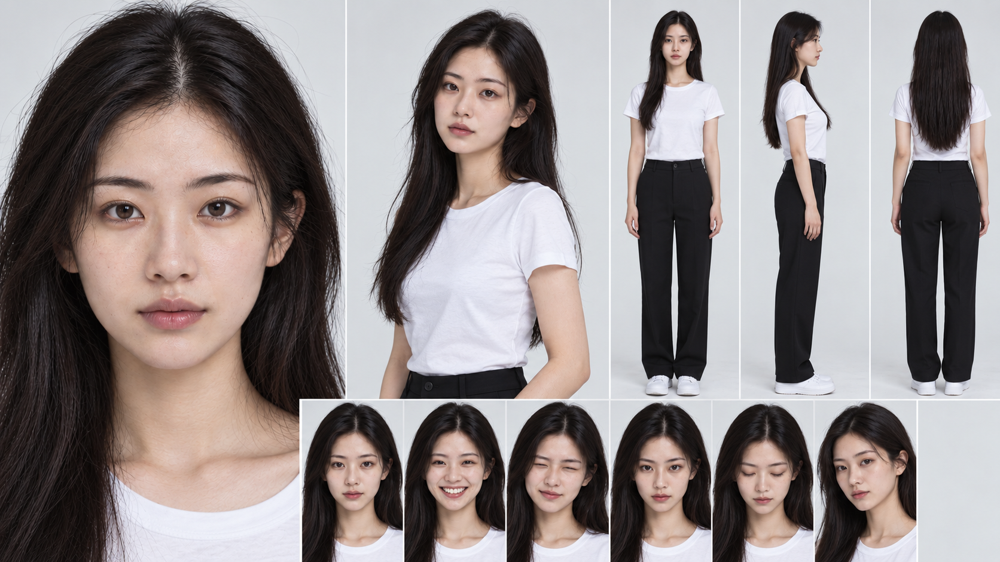
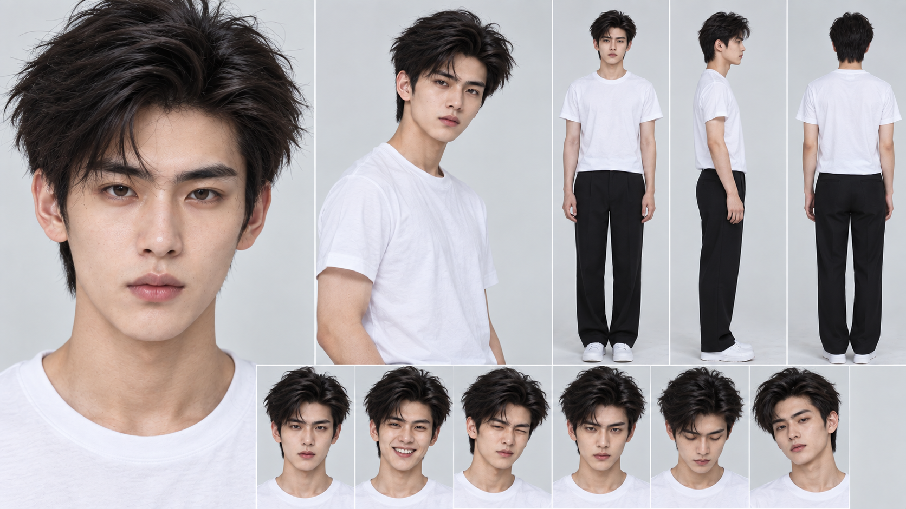
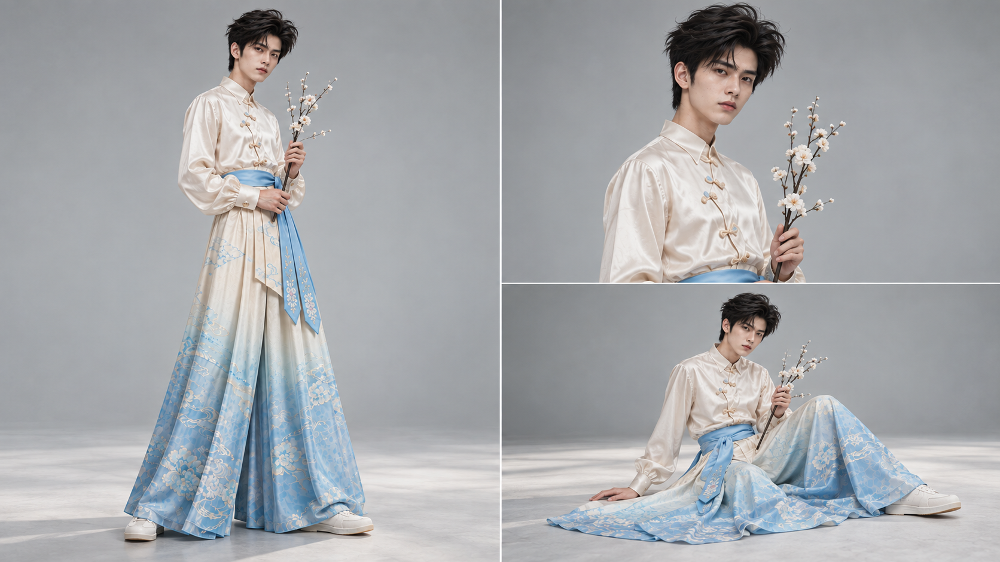
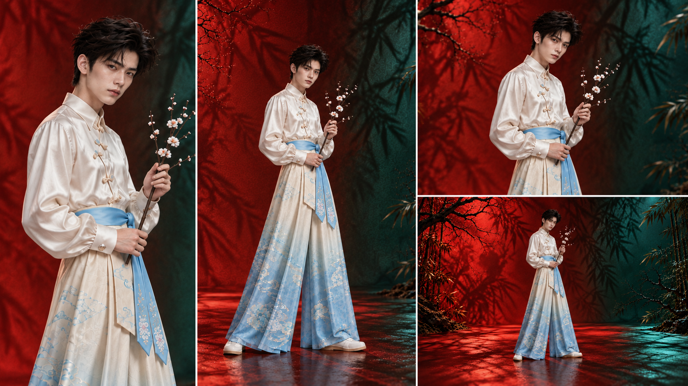
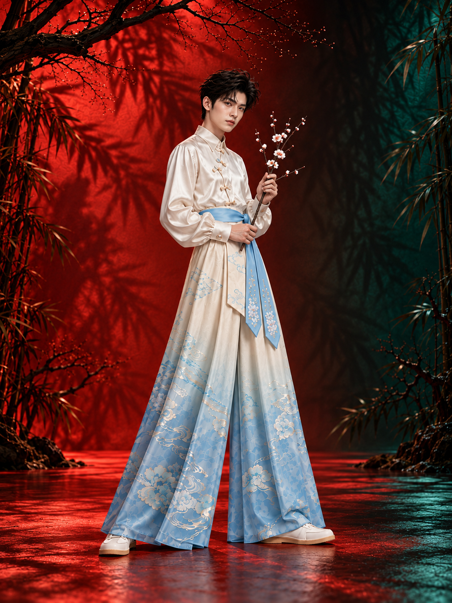
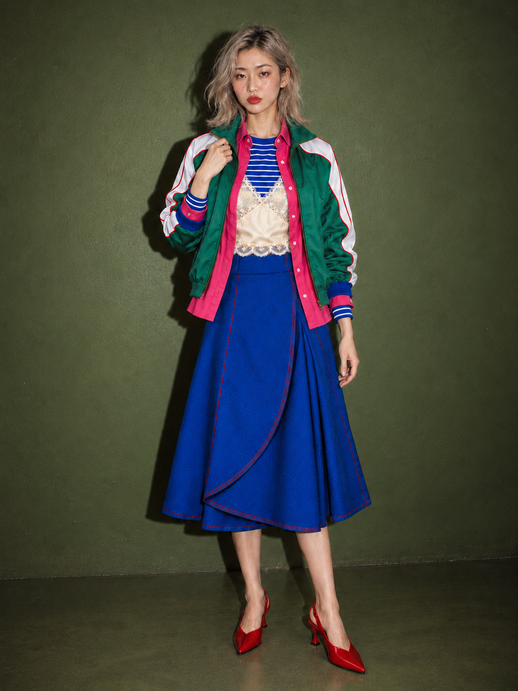
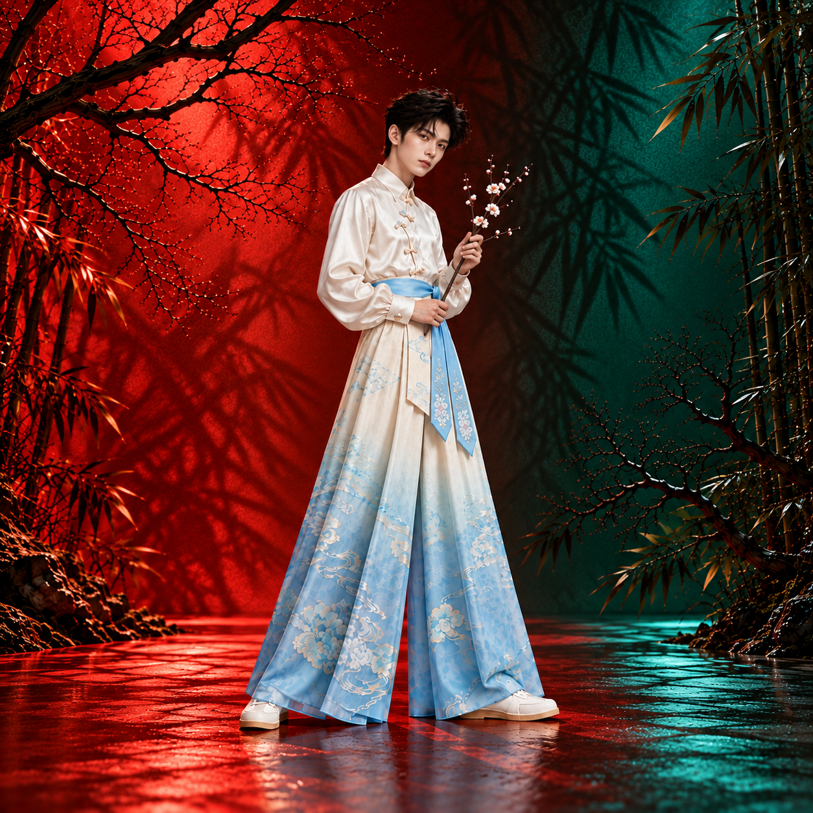
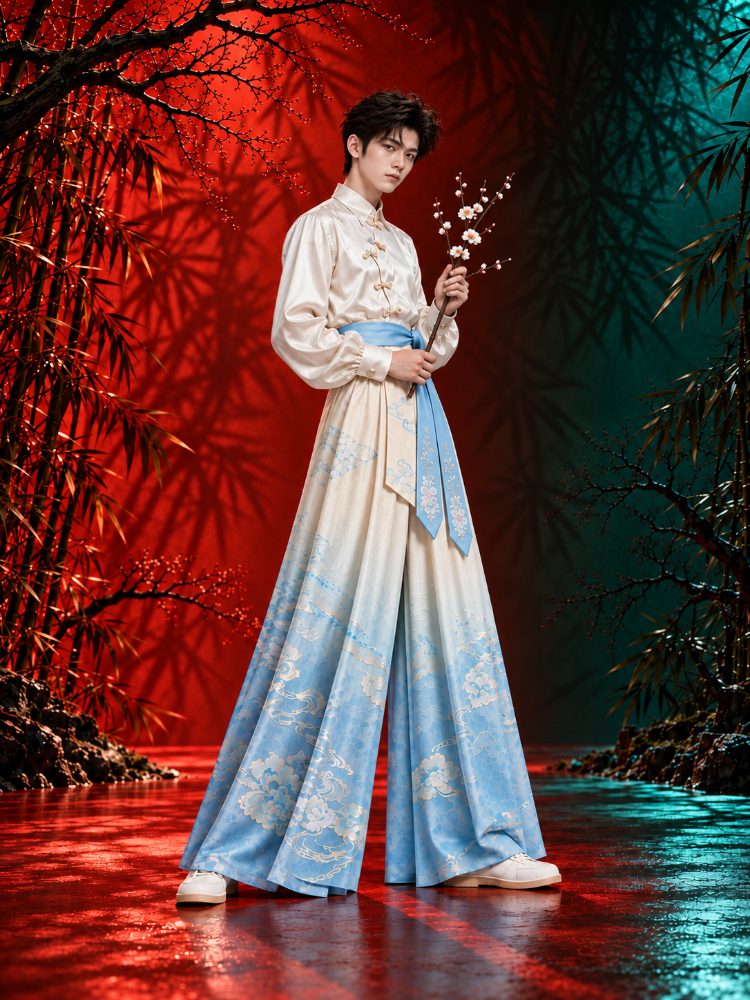
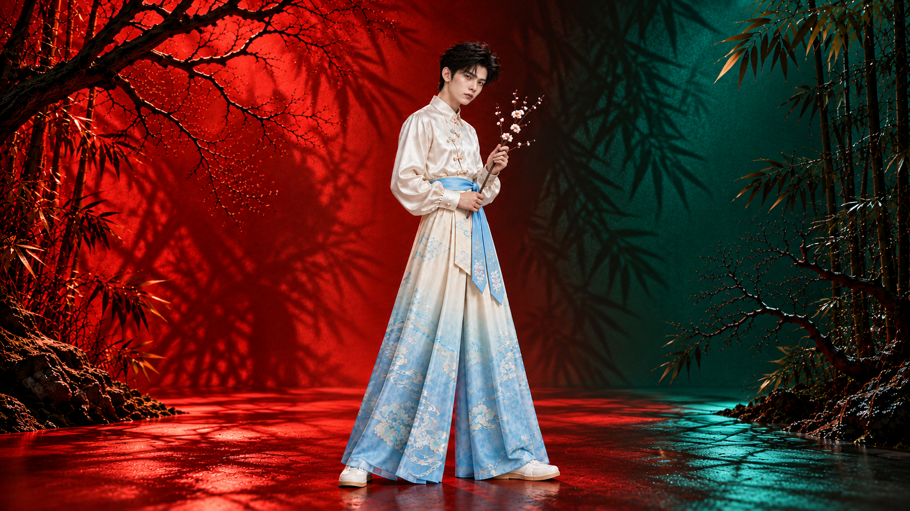

# 服装 AI 商拍 Skill 套件

给一张样衣平铺图，产出**同一模特、跨风格、跨画幅**可交付的商拍成片。

核心立场只有一条：**提示词不手写**。所有进引擎的指令块都由脚本从「配方卡 + 模特电子身份证」组装出来，
所以一张图为什么长这样是可以复盘、可以复现、可以改一轴而其余不动的。

套件形态是 Qoder / Codex 的 Skill 目录，零依赖、零构建，只要 Node 18+。

---

## 效果示例

以下示例均由本套件链路产出，用来标出链路上每一环的验收物长什么样。

### 1 · 模特电子身份证（SO ID 模卡）

单张 16:9 五模块：脸部细节、人物 hero、三视图、核心表情 2x3、白 T 黑裤统一服装基准。
这张卡是后续所有成片的身份来源，也是表情取值的唯一词表。

<table>
<tr>
<td></td>
<td></td>
</tr>
</table>

下方 2x3 六格是固定词表：松弛平视 / 大笑 / 鬼马眨眼 / 冷感凝视 / 垂眸 / 微侧呼吸感。
分镜表里写表情，只能从这六格里点名字，不自造格子。

### 2 · 默认棚拍（人设图定稿后的第一选择）

同一身份、同一件样衣，中性无缝背景 + 柔光箱，出的是**能直接上架的目录成片**。
三格的景别差由分镜表逐格供给，不是同一张图裁三下。



### 3 · 实景 / 剧场：同一身份换一套光学语言

换成手绘色底 + 植物投影的实景语言，模特身份与服装不变，变的是场景、光位与介质。
一条批量只换一张配方卡，不在同一批里混多套光学配置。



### 4 · 三种风格方向

风格轴（幼态网感 / 新中式禅意 / 轻欧美极简）与用途轴（P 目录 / C 种草 / T 剧场）是**两条正交的轴**，
一张配方卡同时携带两者。

<table>
<tr>
<td align="center"><br><b>01 幼态网感</b></td>
<td align="center"><br><b>02 新中式禅意</b></td>
<td align="center"><br><b>03 轻欧美极简</b></td>
</tr>
</table>

### 5 · 全渠道画幅导出

同一张认可成片铺到 1:1（淘宝天猫主图）、3:4（小红书 / 抖音）、16:9（品牌画报）。
优先按目标画幅**原生生成**；必须改画幅时走 AI 外扩，只延展环境，服装本体永不参与生成式扩展。
像素拉伸与裁切衣物是硬禁令。

<table>
<tr>
<td align="center"><br>1:1</td>
<td align="center"><br>3:4</td>
</tr>
<tr>
<td colspan="2" align="center"><br>16:9</td>
</tr>
</table>

---

## 六个 skill

| skill | 职责 |
|---|---|
| `fashion-shoot` | 入口与总编排，六步傻瓜向导（选风格 → 选或建模特 → 定场景 → 传样衣 → 选渠道 → 导演规划表） |
| `fashion-soid` | 模特电子身份证 SO ID 与 16:9 五模块模卡 |
| `fashion-director` | 导演规划层：默认 10 格分镜表（景别 / 机位 / 动作 / 表情 / 用途画幅），**出表即停，用户确认后才放行出图** |
| `fashion-swap` | 换装与一体化成片，含无蒙版引擎下的措辞规范与高风险工艺兜底 |
| `fashion-export` | 全渠道画幅适配与外扩 |
| `fashion-photo-core` | 共享规范层：21x9x3 模型、风格矩阵、配方库、schema、组装器与校验脚本（不单独响应请求） |

---

## 核心机制

### 光学参数模型 21x9x3

一张配方卡把"这张图为什么高级"拆成可点名的槽位：

- **A1-A4** 镜头：焦段、透视压缩、畸变控制、微距可辨细节
- **B1-B4** 光圈与景深：T 值、前后景分配、焦平面、散景质地
- **C1-C4** 运动：快门、拖影、瞬间取点
- **D1-D5** 光位：主光方向、比光比、暗部容许度、轮廓光、电子感禁令
- **E1-E4** 成像介质：数字/胶片取向、颗粒、高光滚降
- **L1-L9** 机位语言：景别、高度、水平角度、俯仰角、留白、视线侧、运动矢量、前景遮挡、画幅切分
- **Q1-Q3** 质地：皮肤、织物、发丝

`L4` 俯仰角硬上限 ±15°，超了骨骼畸变；`expression.gaze` 必须与 `L6` 同值，否则校验报错。

### 覆盖段：改一轴，其余仍按卡走

自由输入只允许替换**场景 / 动作 / 介质 / 机位 / 表情**这几段，21x9x3 的光学段、禁令、色板仍由卡片供给。
运行时替换，卡片文件永不改动——这是"用户说'要富士效果'"和"规范可复现"能共存的前提。

```bash
node <CORE>/scripts/build-prompt.mjs \
  --recipe r-01-P-catalog-softbox --so-id so-ids/SO-0007.json \
  --framing 中全,微俯,四分之三侧,5 --motion 横穿画面 --expression 垂眸 \
  --action "双手自然垂放，左手轻扶裙侧，五指根根分明" \
  --garment 平铺正面.png,平铺背面.png --garment-risk "小文字排版" \
  --out work/shot-01.txt
```

`--framing` / `--motion` / `--expression` 的取值全部从 `schemas/recipe.schema.json` 的枚举里读，
不合法的格子名直接拒绝出指令。导演分镜表的 10 格就是靠这三个旗标逐格变成可执行命令。

### 风险闸门：不通过就不出图

命中高风险工艺（重工刺绣、钉珠亮片、提花、小文字排版、logo）而本卡没有细节微距参考时，
组装器**拒绝产出指令块**，而不是硬着头皮生成一张糊的。未校准卡（`status: inferred`）在
`validate.mjs --strict` 下失败，防止推导方案被直接用于批量交付。

`--allow-inferred` / `--allow-high-risk` 存在，但用途是排查，不是绕过。

### 措辞禁令

不许出现品牌名与艺人名；不许用"高级感""氛围感"这类空词代替光学参数；
身份段（骨相、脸型、瞳色）在任何覆盖下都不可触碰。指令块自带【参考图分工】编号，
投喂顺序必须与编号一致——顺序错等于串角色。

---

## 安装与自检

解压后确认六个 skill 目录都在，然后**在项目根**跑：

```bash
node <CORE>/scripts/validate.mjs                  # 结构校验
node <CORE>/scripts/build-prompt.mjs --audit      # 全库强制项审查
node <CORE>/scripts/validate.mjs --strict         # 定稿前：未校准卡在此模式下失败
```

`<CORE>` 按宿主替换：Qoder 为 `.qoder/skills/fashion-photo-core`，Codex 为 `.codex/skills/fashion-photo-core`。
脚本只用 Node 内置模块，不需要 `npm install`。校验器从工作目录解析 `so-ids/` 与校准样片路径，换目录跑会误报。

新宿主第一次装好，按 `tests/01-跑通梯子.md` 从步骤 -1 开始跑：
先声明验的是哪条链路 → 画幅探针 → 模卡 → 身份复用 → 最小换装 → 一体化成片 → 多画幅导出。
跳过前几轮直接批量，会把「通路没通」误判成「方案不行」。

## 已知缺口（照实说）

| 项 | 状态 |
|---|---|
| 配方矩阵覆盖 | 目标 3 风格 × P/C/T = 9 格，已建 6 卡（5 张已过样片校准）。缺 `01-T`、`03-P`、`03-T`；`03-C` 仍为推导态 |
| 主链路画幅与配额 | `1:1 / 2:3 / 3:4 / 16:9 / 21:9` 哪些真能出、参考图张数上限、实际分辨率——**主链路侧一项都未实测**，首跑必须先做画幅探针 |
| `engine_limits` 口径 | 只描述随包的 Gemini 适配器，不是宿主通用能力声明 |
| 校准样片库 | 第三方参考图不随包分发，整块缺失时校验器只给警告 |
| `so-ids/SO-*/refs/` | 用户投喂的骨相参考原件（含第三方人脸）不在包内，因此 `identity_refs` 登记的路径在本仓库不存在，属正常现象 |
| 示例图 | 本页示例展示的是链路与取向，未逐张标注 `recipe_id`；配方卡的实际取值以 `recipes/*.json` 为准 |

## 目录结构

```
.qoder/skills/            六个 skill 的规范树（唯一真源）
  fashion-shoot/          入口与向导
  fashion-soid/           SO ID 模卡
  fashion-director/       导演分镜规划表
  fashion-swap/           换装与成片
  fashion-export/         画幅导出
  fashion-photo-core/     共享规范层
    recipes/              配方卡分片 + manifest
    references/           21x9x3 模型、风格矩阵、中国色规范
    schemas/              recipe.schema.json / so-id.schema.json
    scripts/              build-prompt.mjs / validate.mjs / gemini-image.mjs / fingerprint.mjs
tests/01-跑通梯子.md      新宿主验收阶梯
so-ids/*.json             身份元数据（SO-0007 仅为结构示例，不代表已获授权）
demo/fuji/                --medium 的对照预演图，非正式链路产物
docs/samples/             本页示例图
package.py                从同一棵规范树打 Qoder / Codex 两个包
INSTALL.md                安装说明
_素材投喂清单.md          想让套件贴合你的审美需要投喂什么
```

## 打包分发

```bash
SUITE_STAMP=20261001 python3 package.py
```

从同一棵规范树打两个包：`.qoder/skills/` 与 `.codex/skills/`。
用 `zipfile` 而非系统 `zip`——macOS 的 `zip` 不给非 ASCII 文件名打 UTF-8 标志位，解出来全是乱码。

## 授权与标识

- 示例图为 AI 生成，投放渠道要求的显式 AI 标识按渠道自行加；隐形水印不替代显式标识。
- `so-ids/SO-0007.json` 仅作结构示例，不代表已获真人授权。正式跑图前授权文件需自备。
- 本仓库不含第三方人脸参考原件与校准样片库。
